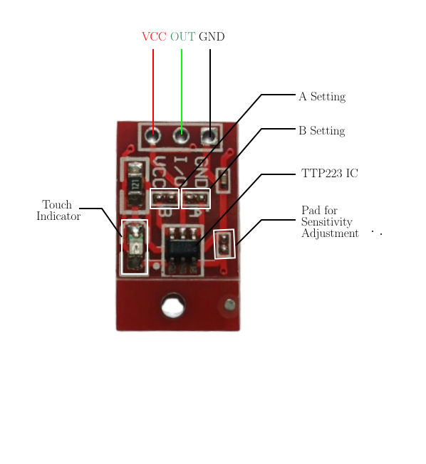
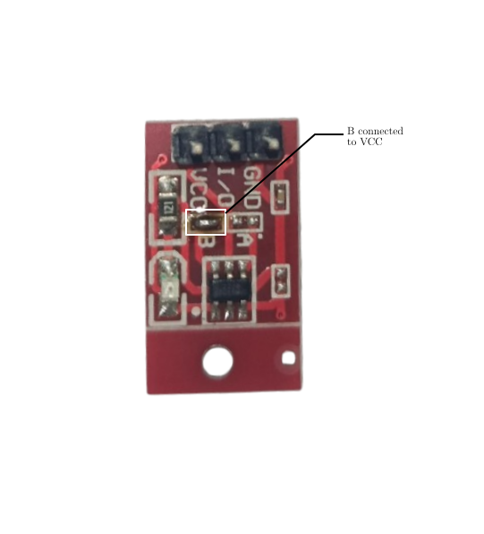
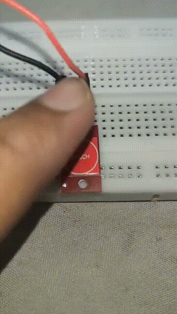
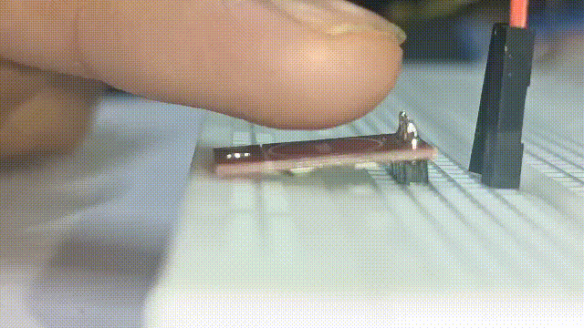
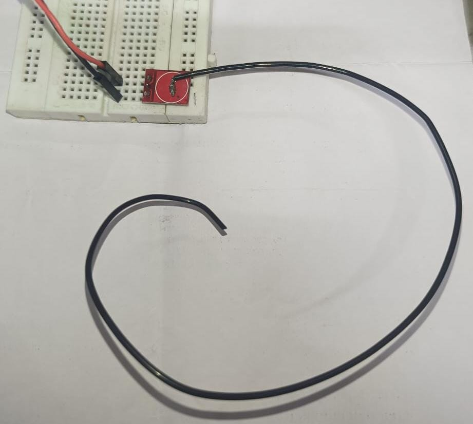
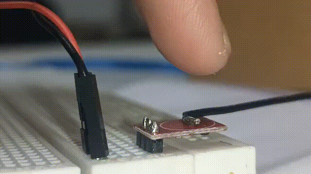

In this article, I'm going to discuss about TTP223 Capacitive Touch Sensor module.

A capacitive touch sensor detect touch by measuring variation in capacitance when a conductive object is brought closer to the sensor. 

Generally, in a capacitive touch sensor, copper pad on PCB act as bottom conductive plate, PCB material along with air act as dielectric and our finger act as the second plate. Therefore a capacitance is formed when our finger is brought closer to the copper pad.  TTP223 will detect this change in capacitance and provide an output. TTP223 can be configured for Active HIGH or Active LOW output. In both modes it suports both momentary and self latching output. However, every TTP223 module may not provide us the choice to configure. 

Here, I'm using this small red TTP223 capacitance touch module which provide us configuration choice. By default it comes in Active HIGH momentary output configuration. Inorder to configure the output, we have to short the necessary A or B pad to VCC (VCC pad is available near to both A and B).

  

- If both A and B are left unconnected to the nearby VCC pad, which is the case by default, Output will be momentarily high when touched.
- If only A is connected to VCC, output will be low momentarily when touched and high otherwise.
- If only B is connected to VCC, output will be latched to high when touched. It will become low when touched again.

- If both A and B are connected to VCC, output will be latched to low when touched. It will be latched back to high when touched again. 
  
Here, i have connected B to VCC, which will act in self latching active high mode.

  

    
  

  

    
  

One thing to note is that, you don't actually need to touch  the sensor to turn it on. Capacitance will be formed at a small distance and hence produce the output as shown below.

  

If yo do not want false detecton or if you just want to reduce the sensitivity, you can add a capacitor (10pF or so) across the pad for sensitivity adjustment.

If you need to increase the sensitivity, you can add a conductor to the copper pad

  
  
  

I hope you understood my blog. If any queries, feel free to reach out to me. Thank You!

# References
1. [Capacitive TTP223 Touch Sensors Explained with Arduino - Mario's Idea](https://www.youtube.com/watch?v=JuV29EQ96uQ)